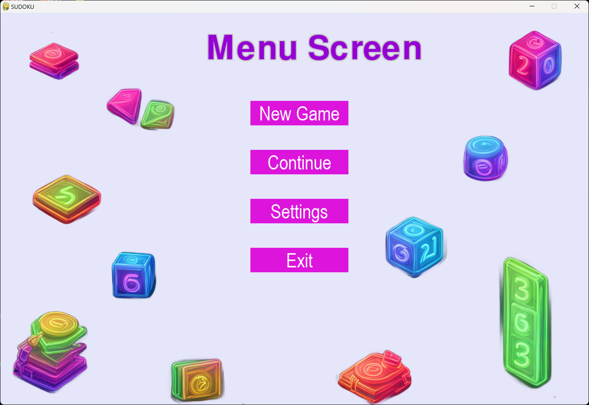

# Sudoku Game

Built a working Sudoku game that can work on any PC using Python (pygame library).


## Table of Contents

- [Features](#features)
- [Installation](#installation)
- [Usage](#usage)
- [Screenshots](#screenshots)
- [How to Play](#howtoplay)
- [Contributing](#contributing)
- [License](#license)
- [Acknowledgments](#acknowledgments)
- [Author](#author)
## Features


- Graphical user interface with a Sudoku board.
- Randomly generated puzzles with different difficulty levels.
- Real-time feedback on the correctness of entered values.
- Timer to track the time spent on solving the puzzle.
- Multiple difficulty levels: Easy, Medium, Hard, and God Mode.
- Intuitive drag-and-drop interface for entering values.
- Responsive buttons for navigation and game controls.
- Puzzles are created and checked through backtracking algorithm

## Installation

1. Make sure you have Python 3.x installed.
2. Install the Pygame library:

   ```bash
   pip install pygame

3. Clone the project

    ```bash
    git clone https://github.com/aabbi15/sudoku_pygame.git
    cd sudoku_pygame

4. Run the homescreen file

    ```bash
    python homescreen.py
## Usage

Alternatively you can go inside the dist folder and run the executable file named homescreen.exe to Run the game directly


## Screenshots





## How to Play

- Drag and drop numbers from the panel to the empty cells.
- Real-time feedback will indicate whether the entered values are correct.
- The timer will track the time spent on solving the puzzle.
- Choose different difficulty levels from the menu.
  
## Contributing

Contributions are always welcome!

Please let me know if you find any bug or issues.


## License

This project is licensed under the MIT License - see the `LICENSE` file for details.


## Acknowledgements

- Special thanks to the Pygame library for providing a versatile platform for game development in Python.

- Feel free to reach out to the me


## Author

- Name: Abhishek Abbi
- Github: [@aabbi15](https://www.github.com/aabbi15)
- Mail: abhishekabbi.work@gmail.com
- X: [@AbhishekAb70528](https://twitter.com/AbhishekAb70528)

